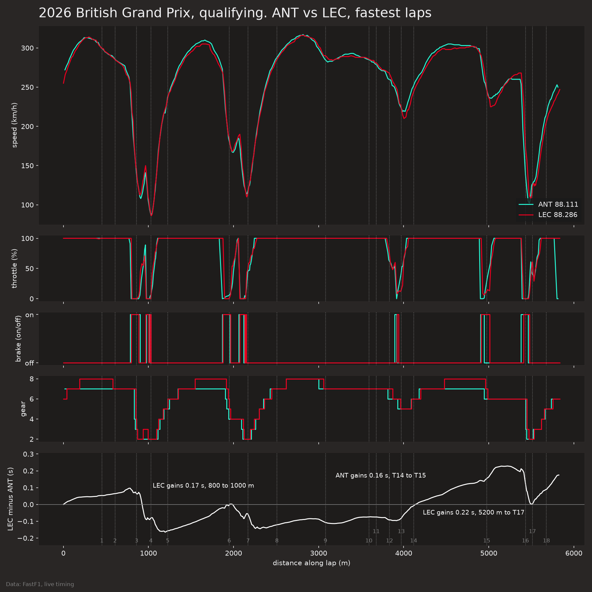
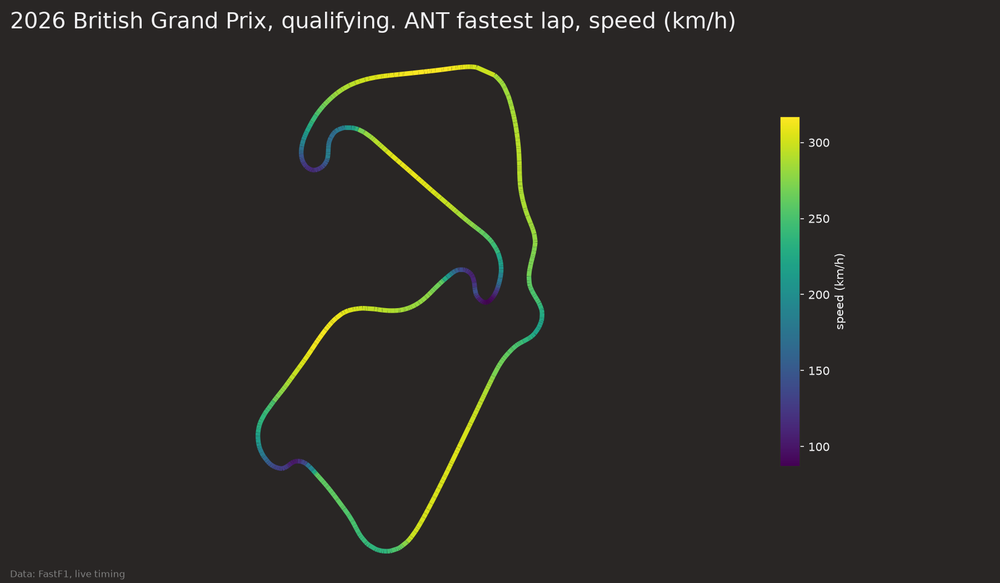
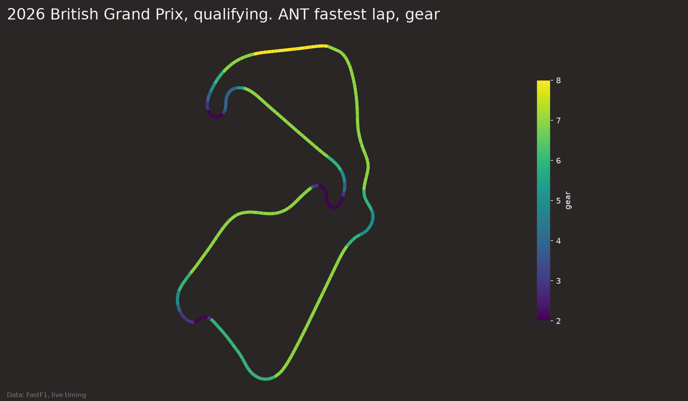

# outlap

I wanted to see how much time a tire loses per lap once fuel burn is removed. I used the 2026 British Grand Prix because it was dry and 17 of 22 drivers ran three stints.

## data and cleaning

Everything comes from FastF1 (live timing), loaded through a local cache. The race has 1,113 laps. I drop lap 1, in and out laps, any lap with a non-green track status code, deleted laps, laps slower than 107 percent of the fastest lap, and stints with fewer than 5 clean laps. That leaves 755 laps. The soft compound then has a single stint of 10 laps, which is too little for a slope or an interval, so I drop it too and model mediums and hards only. 745 laps remain. `data_quality.md` lists every dropped lap with its reason, per driver.

The race had a lot of safety car and yellow running. 165 laps went for track status alone, so most stints are shorter than a normal strategy would give.

Lap times are fuel-corrected as lap time plus 0.03 s per kg times the fuel already burned. I assume a 70 kg start load and a linear burn over 52 laps. The 70 kg figure comes from secondary sources on the 2026 rules (planetf1, f1chronicle), and I did not check it against the FIA document. The 0.03 s per kg comes from analyses of the heavier 2025 cars and may be off for these cars. That is why the fuel effect is a parameter in `config.py` and the results are repeated at 0.02 and 0.04 below. Tire age is my own count of laps since the stint began, because FastF1's TyreLife includes laps from earlier sessions on used sets.

## baseline

For each driver-stint I fit a straight line of fuel-corrected lap time against tire age. The mean slope per compound, with a 95 percent bootstrap interval that resamples whole stints:

- medium: about 0.040 s per lap, interval 0.024 to 0.056, from 24 stints
- hard: about 0.061 s per lap, interval 0.036 to 0.091, from 21 stints

The two intervals overlap, so I would not say hards degrade faster. Hard stints also come later in the race, when the track has changed and the field is more spread out, and I do not model either.

Changing the fuel effect moves the slopes directly. At 0.02 s per kg the medium slope is 0.026 and the hard slope is 0.047. At 0.04 it is 0.053 and 0.074. Every 0.01 s per kg shifts both slopes by about 0.014 s per lap, so the fuel assumption moves the result by more than half the gap between the two compounds.

## improved model

I fit a mixed-effects model with compound, compound-specific tire age and track temperature as fixed effects and a random intercept per stint. I chose it because laps inside a stint are not independent and there are only 45 stints. Both models are scored on held-out stints with 5-fold grouped cross-validation, so no stint appears in training and test. For each held-out stint the first 3 clean laps set its level and the remaining laps are predicted. That gives 610 scored laps.

Mean absolute error in seconds per lap, baseline against mixed model:

- medium: 0.353 against 0.361
- hard: 0.530 against 0.543
- all: 0.435 against 0.445

The mixed model did not beat the baseline. Track temperature barely moved during the race (37.5 to 43.8 degrees C), so it has little to add. I keep the baseline as the headline number.

## what I would not trust

Traffic and DRS trains are not modeled, which likely inflates the scatter for midfield cars. The scatter plot shows fuel-corrected times rising by about 1 s over the first 12 laps of a stint for both compounds, which is steeper than the linear slopes suggest. I did not test why. Bunching after safety car restarts is my guess. The hard LOWESS curve above 25 laps of age rests on a handful of laps and I would not read it. The error of about 0.4 s per lap is larger than the degradation signal of 0.04 to 0.06 s per lap, so the per-lap predictions say little about tire wear. One race also cannot tell me whether any of this holds at other circuits.

## figures

`figures/degradation_scatter.png`, `figures/stint_view.png` and `figures/error_comparison.png`.

## stage 2: telemetry features

I added ten lap features from car telemetry: top speed, full-throttle fraction, number and total time of brake zones, mean brake onset distance, mean apex speed, mean throttle pickup distance, lift-and-coast distance, shift count and mean apex gear. `features.md` has one line on each, including its weakness. The race model uses the previous lap's values for the same driver, computed on all laps before cleaning, so a feature never comes from the lap it is predicting. Qualifying is used only for the corner positions and the plots below.

I added the features to the stage 1 mixed model one group at a time and scored each on the same held-out stints, 610 laps. The change column is the mean error change against the stage 1 mixed model, with a 95 percent bootstrap interval over stints.

```
model                          MAE (s)   change    interval
baseline (compound mean slope)   0.435
stage 1 mixed                    0.445
+ speed                          0.438    -0.007    -0.019 to +0.005
+ braking                        0.438    -0.010    -0.024 to +0.006
+ corners                        0.447    +0.002    -0.002 to +0.006
+ lift_coast                     0.445    +0.001    -0.001 to +0.003
+ gears                          0.446    +0.002    -0.004 to +0.008
+ all groups                     0.428    -0.016    -0.039 to +0.006
```

No group has an interval that excludes zero, so I cannot say any of them helps. Speed and braking lower the error a little, corners, lift-and-coast and gears do not, and I leave those three out. All groups together reach 0.428, which is 0.007 s under the baseline, but the interval against the stage 1 model includes zero and this is one race with 45 stints. I would read it as a small hint, not a result. The earlier code also had a bug: held-out laps from stints whose first laps were dropped went unscored, which is why the stage 1 errors are now 0.435 and 0.445 instead of 0.493 and 0.509.

### qualifying comparison



ANT's fastest lap, 1:28.111, is 0.175 s quicker than LEC's 1:28.286. LEC is ahead by up to 0.16 s at T5 (1,226 m) and gains 0.17 s between 800 and 1,000 m, where the lowest speed in the 880 to 980 m stretch is 113 km/h for LEC against 108 for ANT. ANT gains 0.16 s from T14 to T15 (4,117 to 4,976 m), with a mean speed of 302.3 km/h against 299.4 between 4,400 and 4,900 m. LEC gains 0.22 s from 5,200 m to T17, braking for T16 at 5,410 m against 5,380 m for ANT with a lowest speed of 108 against 102 km/h, and ANT then gains 0.17 s from T17 to the line.



ANT's lap peaks at 317 km/h and is slowest at 87 km/h at the T4 apex. The slowest stretches are T3 to T4 and T16 to T17, with T7 the other low-speed corner.



The same lap is in second gear at the T3, T4, T7, T16 and T17 apexes, and the mean apex gear over the 18 corners is 4.7.

## reproduce

```
python3 -m venv .venv && .venv/bin/pip install -r requirements.txt
.venv/bin/python -m src.run
.venv/bin/python -m src.stage2
.venv/bin/python -m pytest
```

`src.run` downloads the race on first use, writes `data_quality.md`, `results.md` and the stage 1 figures. `src.stage2` also loads qualifying and writes `results_stage2.md` and the qualifying figures. Every number above is in `results.md`.
